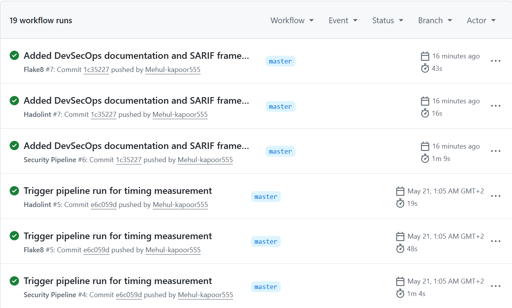
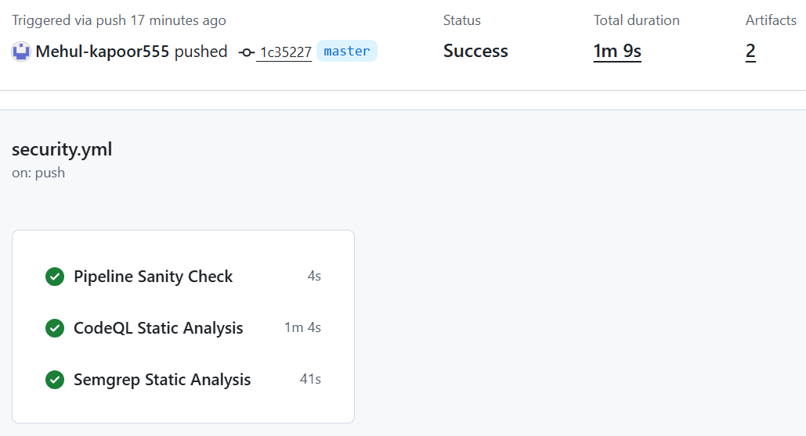
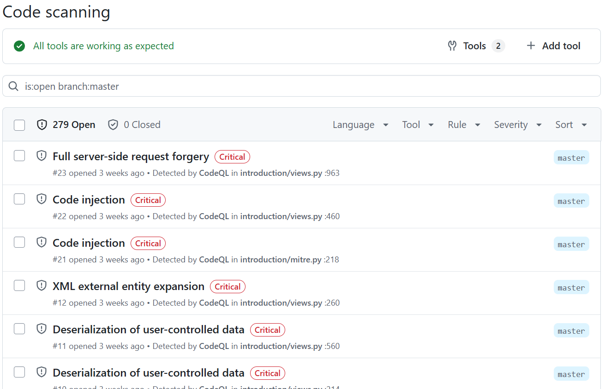
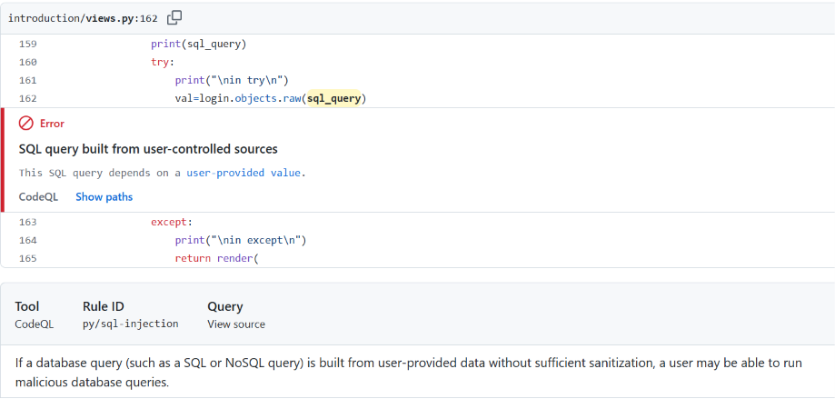

# DevSecOps Oriented Vulnerability Detection Pipeline

## Integration of Security Analysis into the Software Development Lifecycle

This project presents a lightweight DevSecOps pipeline designed to integrate automated security analysis directly into the software development lifecycle using GitHub Actions.

The system performs Static Application Security Testing automatically whenever code is pushed to the repository or when a pull request is created. The project follows the shift left security principle by introducing security analysis early in the development workflow rather than treating security as a final stage before deployment.

The pipeline integrates two modern Static Application Security Testing tools, CodeQL and Semgrep, and unifies their findings through SARIF based reporting inside the GitHub Security interface. The project also includes a custom Python based SARIF post processing and comparison framework used to normalize findings, analyze overlap and duplication, and generate comparative security evaluation reports.

The project was developed as part of a bachelor internship and focuses on practical DevSecOps integration, workflow automation, comparative SAST evaluation, SARIF based security analytics, and CI/CD oriented vulnerability analysis.

---

# Overview

Modern software development relies heavily on collaborative workflows built around Git repositories, pull requests, and continuous integration pipelines. In such environments, delaying security analysis until the end of development increases the likelihood that vulnerabilities become deeply embedded into the application.

This project demonstrates how automated security analysis can be integrated directly into the CI/CD workflow so that vulnerabilities are detected continuously during development.

The implemented pipeline automatically:

- triggers on push and pull request events
- performs semantic and rule based static analysis
- generates and post processes SARIF security reports
- uploads findings into GitHub Security
- provides centralized developer feedback
- supports reproducible security analysis and comparative evaluation

The project emphasizes DevSecOps integration, operational evaluation, SARIF based post processing, and comparative security analysis rather than the development of new vulnerability detection algorithms.

---

# Motivation

Security is often treated as a separate phase performed after development has already progressed significantly. This traditional approach makes vulnerabilities more expensive and difficult to resolve.

DevSecOps addresses this issue by embedding security practices directly into the development lifecycle. The shift left philosophy encourages security validation during coding and review stages so developers receive immediate and actionable feedback.

This project was motivated by the need to study how modern SAST tools behave when integrated into real CI/CD workflows and how effectively they support continuous security analysis during development.

---

# Technologies Used

| Technology | Purpose |
| :--- | :--- |
| GitHub Actions | CI/CD workflow automation |
| CodeQL | Semantic static analysis |
| Semgrep | Rule based static analysis |
| SARIF | Standardized security reporting |
| Python | Target application language |
| Ubuntu GitHub Runners | Workflow execution environment |

---

# Why PyGoat Was Chosen

The project uses a fork of the OWASP PyGoat application as the target repository for security analysis.

PyGoat is an intentionally vulnerable Django application designed for security education and vulnerability testing. The repository contains realistic examples of common web application vulnerabilities including:

- SQL Injection
- Command Injection
- Cross Site Scripting
- Insecure Deserialization
- Server Side Request Forgery
- Weak Cryptography
- XML External Entity vulnerabilities

PyGoat was selected because it provides a realistic application structure while ensuring the presence of known vulnerabilities required for evaluating security analysis tools.

No vulnerabilities were added or modified as part of this work. The contribution of this project lies in the DevSecOps pipeline integration, workflow automation, and comparative evaluation of the integrated tools.

Original project:

https://github.com/adeyosemanputra/pygoat

---

# Pipeline Architecture

The workflow is triggered automatically whenever code is pushed to the repository or when a pull request targets the master branch.

The pipeline consists of three independent jobs that execute in parallel:

1. Pipeline Sanity Check  
2. CodeQL Static Analysis  
3. Semgrep Static Analysis  

The generated SARIF reports are uploaded into GitHub Security to provide a unified security dashboard for developers.

```text
Developer Push or Pull Request
            ↓
GitHub Actions Workflow
            ↓
 ┌───────────────────────┐
 │   Parallel Jobs       │
 └───────────────────────┘
     ↓        ↓        ↓
 Sanity   CodeQL   Semgrep
  Check    Scan      Scan
             ↓        ↓
        SARIF Security Reports
                 ↓
        GitHub Security Dashboard

```
# Workflow Overview

The workflow is implemented using GitHub Actions and stored in:

```text
.github/workflows/security.yml
```

The pipeline executes automatically on:

```yaml
on:
  push:
    branches: [ master ]

  pull_request:
    branches: [ master ]
```

The workflow performs the following operations:

- checks out the repository
- initializes analysis environments
- executes CodeQL analysis
- executes Semgrep analysis
- generates SARIF security reports
- uploads findings into GitHub Security
- stores workflow artifacts for reproducibility

The use of parallel jobs helps reduce the total pipeline execution time while allowing multiple security scanners to operate independently.

---

# CodeQL Analysis

CodeQL is a semantic and dataflow based Static Application Security Testing tool developed by GitHub.

The workflow initializes the CodeQL engine for Python and executes the `security-and-quality` query suite to analyze the application source code.

The CodeQL workflow performs the following steps:

- initializes the CodeQL analysis environment
- builds the analysis database
- executes predefined security queries
- generates SARIF security reports
- uploads findings into GitHub Security

CodeQL is particularly effective for vulnerabilities that require deeper contextual understanding and dataflow tracing.

Examples include:

- SQL Injection
- Command Injection
- Path Traversal
- Sensitive Data Exposure
- Log Injection

One of the strongest features of CodeQL is its ability to display detailed source to sink dataflow traces directly inside the GitHub Security interface.

---

# Semgrep Analysis

Semgrep is a lightweight rule based static analysis tool that scans source code using security focused pattern matching rules.

The Semgrep workflow executes inside the official `semgrep/semgrep` container and uses multiple rule packs including:

- `p/python`
- `p/django`
- `p/security-audit`
- `p/owasp-top-ten`

The workflow generates SARIF reports which are uploaded into GitHub Security alongside CodeQL findings.

Semgrep provides fast execution and broad framework specific security coverage.

The tool is particularly effective for detecting:

- Cross Site Scripting
- framework misconfigurations
- CSRF related issues
- insecure coding patterns
- hardcoded credentials
- dangerous function usage

Semgrep is especially useful for fast CI/CD feedback during pull request analysis.

---

# Security Findings Summary

The integrated security pipeline successfully detected a broad range of vulnerabilities across the target application.  
The findings demonstrate the complementary nature of semantic and rule based static analysis approaches.

A total of 279 findings were generated across both tools:

- 171 findings from CodeQL
- 108 findings from Semgrep

The detected vulnerabilities covered injection flaws, framework misconfigurations, insecure deserialization issues, weak cryptography, sensitive data exposure, XML related vulnerabilities, and authentication related weaknesses.

| Category | CodeQL | Semgrep |
| :--- | :---: | :---: |
| CSRF | 0 | 44 |
| Code Injection | 2 | 4 |
| Command Injection | 5 | 5 |
| Cookie Security | 6 | 12 |
| Cross Site Scripting | 0 | 10 |
| Dangerous File Write | 0 | 4 |
| Framework Misconfiguration | 3 | 8 |
| Hardcoded Credentials | 0 | 1 |
| Insecure Deserialization | 3 | 8 |
| Log Injection | 4 | 0 |
| Path Traversal | 1 | 0 |
| SQL Injection | 2 | 2 |
| SSRF | 1 | 1 |
| Sensitive Data Exposure | 6 | 0 |
| Weak Cryptography | 4 | 6 |
| XML Security | 1 | 0 |
| XXE | 1 | 3 |

The results revealed clear differences in tool behavior and detection strategy.

Semgrep detected a larger number of framework and configuration related vulnerabilities, particularly CSRF related issues, Cross Site Scripting, and framework misconfigurations.

CodeQL provided stronger coverage for deeper semantic and dataflow oriented vulnerabilities such as Sensitive Data Exposure, Log Injection, and Path Traversal.

Both tools consistently detected canonical injection vulnerabilities including SQL Injection, Command Injection, SSRF, and Insecure Deserialization vulnerabilities.

The evaluation demonstrated that combining multiple SAST approaches improves overall visibility into security weaknesses within CI/CD workflows.

---

# Manual Validation of Findings

To evaluate the correctness and practical usefulness of the generated findings, a representative subset of 17 findings was manually inspected directly against the source code.

The manual evaluation included:

- cross tool agreement cases
- tool specific findings
- high frequency alerts
- ambiguous or low confidence cases
- duplicate findings

The analysis confirmed that the majority of inspected findings represented true vulnerabilities intentionally present inside the target application.

This manual inspection phase helped validate the practical value of the integrated DevSecOps pipeline while also demonstrating the importance of developer triage and contextual review during real world security analysis workflows.

---

# Comparative Analysis

The project compared CodeQL and Semgrep across several operational dimensions relevant to DevSecOps workflows.

| Dimension | CodeQL | Semgrep |
| :--- | :--- | :--- |
| Analysis Type | Semantic and dataflow based | Rule based pattern matching |
| Integration Complexity | Lower | Moderate |
| Execution Speed | Moderate | Fast |
| Feedback Style | Precise path tracing | Actionable remediation guidance |
| Best Use Case | Deep analysis | Fast CI/CD feedback |

---

# SARIF Comparison and Post Processing

In addition to the CI/CD security pipeline, the project includes a custom Python based SARIF comparison and analysis tool developed to support evaluation and post processing of security findings.

Location:

```text
scripts/compare_sarif.py
```

The script processes SARIF outputs generated by CodeQL and Semgrep and performs automated comparative analysis between the two tools.

Key capabilities include:

- SARIF parsing and normalization
- severity normalization across tools
- vulnerability categorization using CWE mapping
- security versus quality finding classification
- cross tool overlap analysis
- within tool duplication analysis
- rule frequency analysis
- CSV export generation
- Markdown report generation

The comparison tool was developed to support the analytical evaluation phase of the project and to provide reproducible metrics for comparing SAST behavior inside CI/CD workflows.

Generated outputs include:

```text
comparison_output/
├── all_findings.csv
├── overlap_analysis.csv
├── rule_duplication.csv
└── comparison_report.md
```

The post processing stage helped quantify:
- vulnerability category coverage
- severity distribution
- duplicate alert behavior
- cross tool agreement
- operational noise generated by each tool

---

# Observations 
Key obervations from the evaluation include:

- CodeQL provides deeper contextual understanding of vulnerabilities
- Semgrep offers broader framework specific coverage
- both tools detect important vulnerabilities missed by the other
- parallel execution minimizes total workflow overhead
- SARIF enables unified multi tool reporting
- alert redundancy remains a practical challenge in real workflows

The results support the idea that combining complementary SAST approaches improves overall security coverage.

---

# Screenshots

The following screenshots demonstrate the operational behavior of the DevSecOps pipeline, GitHub Actions workflow execution, SARIF integration, and vulnerability detection results generated during the project.

---

## Workflow Execution History

This screenshot shows multiple successful executions of the GitHub Actions security workflow triggered through repository pushes.



---

## Complete Pipeline Execution

The complete CI/CD security pipeline executes three independent jobs in parallel:

- Pipeline Sanity Check
- CodeQL Static Analysis
- Semgrep Static Analysis

The parallel execution architecture helps reduce overall workflow duration while supporting multi tool security analysis.



---

## Unified GitHub Security Dashboard

This screenshot demonstrates the centralized GitHub Security dashboard.

The unified dashboard provides centralized visibility into the vulnerabilities detected by CodeQL and Semgrep across the repository.



---

## Example CodeQL Dataflow Analysis

This example demonstrates CodeQL's semantic and dataflow based analysis capabilities.

After clicking the “Show paths” option inside GitHub Security, the vulnerability trace displays how user controlled input propagates through the application and reaches a vulnerable SQL query without proper sanitization.



---

# DevSecOps Project Structure

The following structure highlights the primary files and directories related to the DevSecOps pipeline, SARIF analysis framework, generated evaluation artifacts, and supporting project documentation developed during the internship.

```text
pygoat/
│
├── .github/
│   └── workflows/
│       └── security.yml
│
├── scripts/
│   └── compare_sarif.py
│
├── sarif_reports/
│   ├── python.sarif
│   └── semgrep-results.sarif
│
├── comparison_output/
│   ├── all_findings.csv
│   ├── overlap_analysis.csv
│   ├── rule_duplication.csv
│   └── comparison_report.md
│
├── docs/
│   ├── images/
│   │   ├── pipeline-run.png
│   │   ├── security-dashboard.png
│   │   ├── codeql-paths.png
│   │   └── semgrep-findings.png
│   │
│   └── report/
│       └── DevSecOps_Final_Report.pdf
│
└── README.md
```

### Structure Description

| Path | Purpose |
| :--- | :--- |
| `.github/workflows/security.yml` | GitHub Actions CI/CD security pipeline |
| `scripts/compare_sarif.py` | SARIF comparison and post processing framework |
| `sarif_reports/` | Input SARIF reports generated by CodeQL and Semgrep |
| `comparison_output/` | Generated analytical datasets and evaluation reports |
| `docs/images/` | Workflow and security dashboard screenshots |
| `docs/report/` | Final internship and evaluation report |
| `README.md` | Project overview and technical documentation |

---

# Future Improvements

Possible future extensions include:

- Trivy integration
- dependency vulnerability scanning
- automated finding deduplication
- scheduled deep security scans
- dashboard visualization

---

# About the Target Application

This repository is based on a fork of the OWASP PyGoat vulnerable application.

PyGoat serves as the intentionally vulnerable target system used to evaluate and demonstrate automated security analysis workflows.

The primary contribution of this project is not the vulnerable application itself, but the DevSecOps security pipeline integrated around it.

Original project:

https://github.com/adeyosemanputra/pygoat

---

# Contribution Statement

This project focuses on:

- CI/CD security integration
- automated vulnerability detection
- GitHub Actions workflow development
- SARIF based reporting
- comparative SAST evaluation
- operational analysis of DevSecOps workflows
- SARIF based post processing and comparative analysis automation

The work emphasizes practical security automation and workflow engineering rather than application development.

---

# Author Information

**Mehul Kapoor**

Bachelor Internship Project

DevSecOps Oriented Vulnerability Detection

Integration of Security Analysis into the Software Development Lifecycle